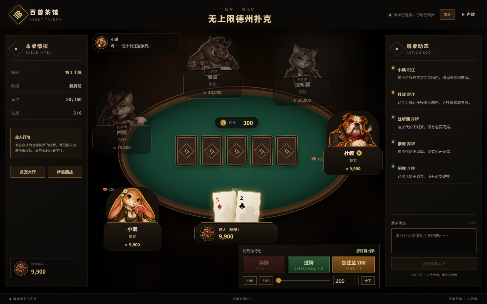
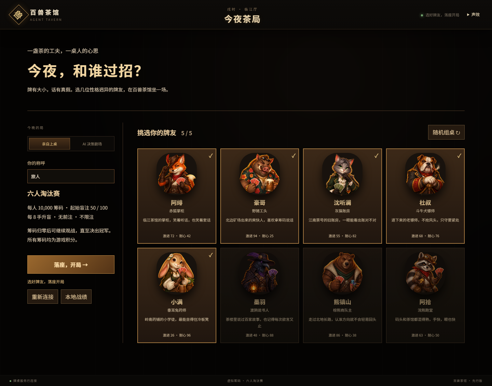
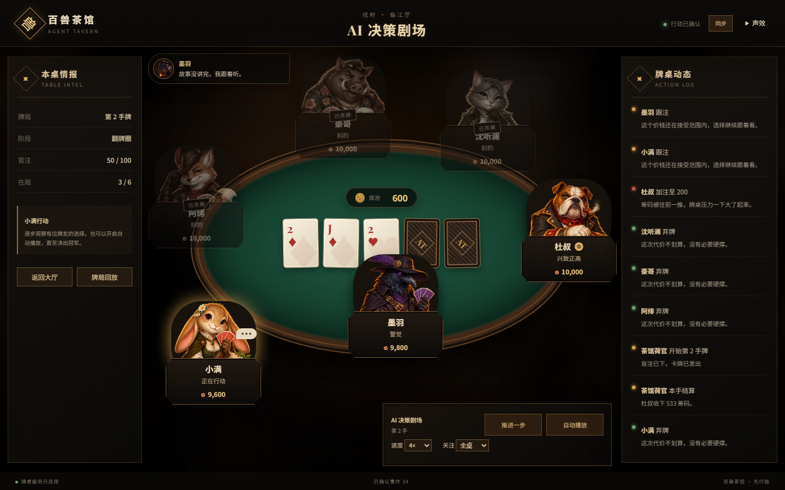
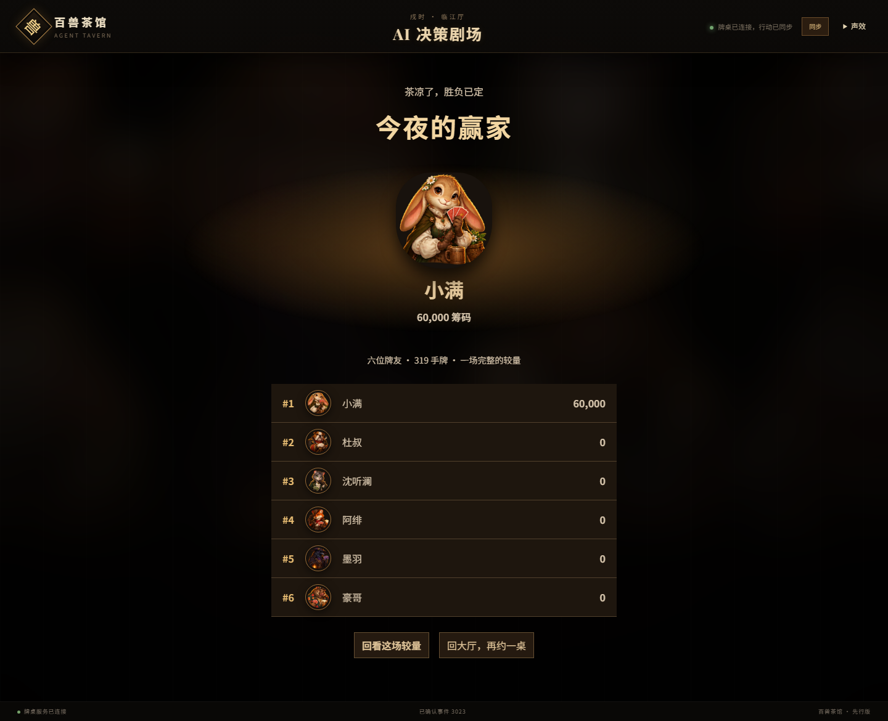
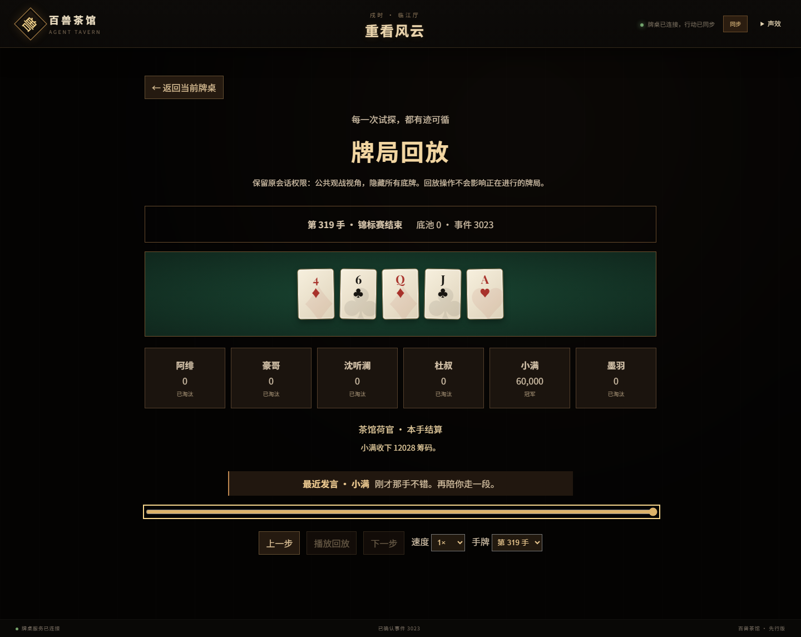
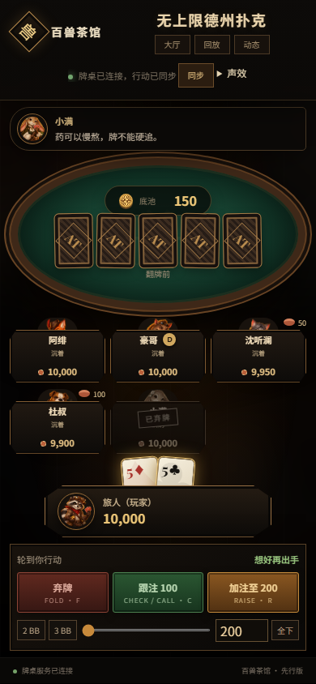

# Agent Tavern · 百兽茶馆

**一桌牌，六种心思。和性格各异的 AI 牌友过招，也可以坐下来，看它们争夺冠军。**

[](https://github.com/yjt0416/poker-agent/actions/workflows/verify.yml)




Agent Tavern 是一款中国幻想茶馆风格的德州扑克游戏。你可以下注、诈唬，也可以开口试探对手；八位牌友各有脾气、策略和情绪，会把桌上的言语当作受控线索。所有发牌、合法动作与筹码结算由服务端裁定。

**[立即运行](#立即运行) · [游戏界面](#游戏界面) · [验收记录](docs/reviews/2026-10-01-local-acceptance.md) · [部署指南](docs/deployment.md)**

## 玩法与体验

| 你想怎么玩 | 茶馆为你准备了什么 |
| --- | --- |
| **亲自上桌** | 从八位角色中选出五位牌友，参加六人淘汰赛。弃牌、过牌、跟注、加注、全下由服务端校验。 |
| **AI 决策剧场** | 六位 Agent 同桌竞技。暂停、单步、0.5× / 1× / 2× / 4× 连续播放，聚焦角色并查看公开行动记录。 |
| **开口过招** | 聊天会影响有限的心理判断，不能改写规则或强制 Agent 执行动作。角色保留同场锦标赛内的记忆与跨手情绪。 |
| **打完再复盘** | 冠军展示、完整排名、脱敏回放；按动作逐步播放、调速、跳转手牌，并查看当时的聊天与局面。 |
| **随时回来** | SSE 实时同步、断线补发与刷新恢复。PostgreSQL 模式还能在后端重启后恢复牌桌、聊天和回放。 |
| **轻松玩一局** | 无密钥即可使用离线 Agent。可关闭的短音效、音量设置、减少动态效果，以及匿名本地战绩。 |

每人 **10,000 筹码**，起始盲注 **50 / 100**，**每 8 手升盲**；无前注，采用无上限下注规则。筹码归零后可以继续观战，直到产生唯一冠军。筹码均为游戏积分。

## 游戏界面

以下截图来自实际运行的游戏。

| 挑选牌友，安排今晚的局 | 观看六位 Agent 争夺冠军 |
| --- | --- |
|  |  |

| 冠军与最终排名 | 沿着时间轴复盘每一手 |
| --- | --- |
|  |  |

<details>
<summary>查看移动端牌桌</summary>



窄屏保留可辨认的底牌和完整操作区；通过“动态”入口展开聊天及行动记录。

</details>

## 立即运行

### Docker 一键启动

需要 Docker Engine / Docker Desktop（Linux 容器）及 Docker Compose。无需在宿主机另装 Java、Node.js 或 PostgreSQL。

```powershell
# Windows：在项目根目录运行
.\scripts\start.ps1
```

```sh
# Linux / macOS
sh scripts/start.sh
```

打开 **[http://localhost:8088](http://localhost:8088)**。脚本首次生成本地数据库密码，默认使用离线 Agent；数据库数据保存在命名卷中。配置、备份和停止服务的方法见 [部署指南](docs/deployment.md)。

### 本地开发

需要 **Java 21** 与 **Node.js 22**。在项目根目录分别打开两个终端：

```powershell
# 终端 1：后端
cd backend
.\mvnw.cmd spring-boot:run
```

```powershell
# 终端 2：前端
cd frontend
npm ci
npm run dev
```

打开 **[http://localhost:5173](http://localhost:5173)**，选择牌友后即可开局。默认 `local` 模式无需数据库与模型密钥；该模式将牌局保存在内存中，后端进程退出后数据会丢失。

需要持久化时，使用 `postgres` profile 并配置 `DATABASE_URL`、`DATABASE_USERNAME`、`DATABASE_PASSWORD`。Docker 启动方案已包含 PostgreSQL 与自动数据库迁移。

### 可选：接入 DeepSeek

离线模式已提供完整游戏流程。若希望使用模型决策，在启动后端的终端设置：

```powershell
cd backend
$env:AGENT_TAVERN_AGENT_PROVIDER = "deepseek"
$env:DEEPSEEK_API_KEY = "<你的密钥>"
.\mvnw.cmd spring-boot:run
```

默认模型为 `deepseek-flash`。模型输出经过解析、合法动作校验与受控修复；请求超时、失败或额度用尽时执行安全降级。默认每次最多生成 512 Token，每个后端进程滚动一小时最多发起 120 次请求，可通过环境变量调整。该限制属于基础调用保护，不能代替账户费用预算。密钥仅通过环境变量传入，不要提交到 Git。

## 设计与技术

| 层次 | 实现 |
| --- | --- |
| 游戏引擎 | Java 21；确定性的牌局状态转换、牌型比较、主池 / 边池、淘汰与升盲。 |
| 服务端 | Spring Boot 4；命令幂等、版本校验、HttpOnly 匿名会话、SSE 与健康检查。 |
| Agent | 独立角色参数、同场记忆、情绪衰减；离线决策器与可选 DeepSeek 适配器。 |
| 持久化 | PostgreSQL 17、Flyway；检查点、事件、命令回执、Web 会话与回放归档。 |
| 前端 | React 19、TypeScript、Vite；大厅、牌桌、观战、结果、回放与本地战绩。 |
| 验证与运行 | JUnit、Vitest、Playwright、axe；Docker Compose、Nginx 与 GitHub Actions。 |

```text
backend/       游戏引擎、锦标赛、Agent、API 与数据库持久化
frontend/      游戏界面、角色资产、组件测试与浏览器测试
scripts/       一键启动、整栈冒烟、并发验收与备份恢复
deploy/        公网反向代理配置示例
docs/          设计规格、部署指南与实际验收记录
```

浏览器只接收面向当前会话的脱敏投影：玩家只能看到自己的底牌，观众不会收到任何未公开底牌。REST、SSE 与回放保持相同权限范围；用于恢复的底牌和牌堆只保存在服务端。匿名战绩存于当前浏览器，观战不计入玩家战绩。

## 测试与验收

完整验收范围和本轮实际结果见 **[本地全流程验收](docs/reviews/2026-10-01-local-acceptance.md)**。浏览器流程覆盖开桌、聊天、行动、刷新恢复、实时同步、观战、淘汰后继续观看、完整锦标赛与回放；同时检查移动端布局及自动 WCAG A / AA 规则。

本轮 **331 项后端测试、27 项前端测试、13 项 PostgreSQL 本地契约通过**；九项浏览器场景在生产预览下分组通过，完整观战赛程实际完成 319 手牌。容器契约在无 Docker 的本机明确跳过，由 Linux CI 单独验证。

后端验证（项目根目录，Java 21）：

```powershell
backend\mvnw.cmd -f backend\pom.xml verify

# PostgreSQL 持久化契约；需要 Docker，或显式配置独立本地测试库
backend\mvnw.cmd -f backend\pom.xml -Ppostgres-it verify
```

前端与浏览器验证：

```powershell
cd frontend
npm ci
npm test
npm run build
npm audit --audit-level=high
npx playwright install chromium
npm run test:e2e
```

运行浏览器测试前先启动 Java 后端。Playwright 默认构建前端并启动生产预览；本地已有 `5173` 服务时会复用。PostgreSQL 测试中明确跳过的项不算通过，独立测试库配置见 [部署指南](docs/deployment.md#自动验收)。

GitHub Actions 的 [`Verify game`](https://github.com/yjt0416/poker-agent/actions/workflows/verify.yml) 执行游戏测试、生产构建、依赖审计、浏览器流程与并发冒烟，并在 Linux Docker 环境验证整栈、SSE、重启恢复和备份恢复。

## 当前边界

核心可玩流程与本地验收已形成完整闭环；公开仓库提供可自行运行的代码与部署配置。**实际公网主机、域名 / HTTPS、生产负载和异地备份恢复仍需在目标环境验收。**

- 当前支持单个后端实例，不能直接水平扩容。Compose 默认只开放本机 `8088`，公网部署需配置反向代理、HTTPS 与 Secure Cookie。
- 会话有效期为 8 小时，过期数据按保留策略清理。另开一桌会替换当前浏览器会话，尚无旧桌历史列表；Agent 记忆限于同场锦标赛。
- 自动浏览器验收以 Chromium 为主，尚无截图差异回归基线；真实设备、其他浏览器和辅助技术仍需补充验证。
- 自定义规则、精彩牌局收藏、成就、难度、牌桌主题及完整角色动画暂缓。现有回放保持会话权限，暂未开放扩展玩家视角。

更细的部署条件、运行指标、调用限额和验证记录均在 [部署指南](docs/deployment.md) 中说明。
